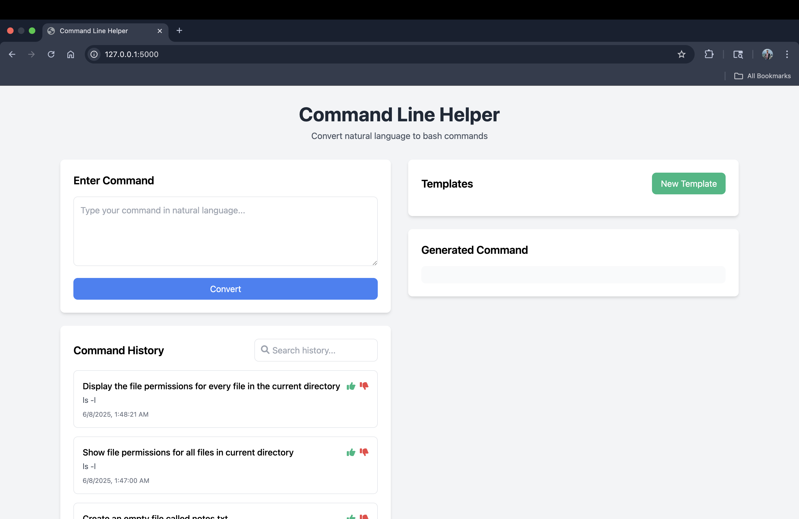
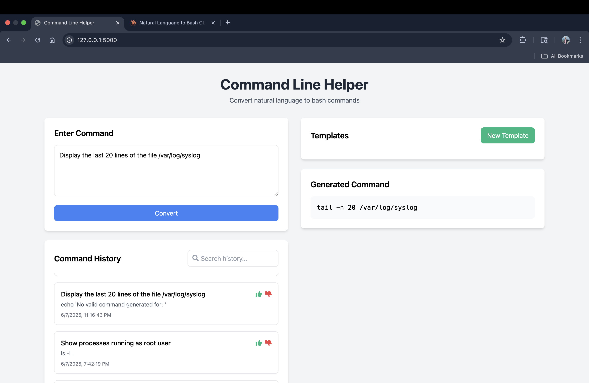

Note: The earlier name of this project was MergeLLM as my initial plan was to merge two LLMs but it's accuracy wasn't that good so i found a different single LLM and used it in this project. So if you find MergeLLM title anywhere, don't get confused.

# CommandLineHelper - Natural Language to Bash Command Converter

This project uses a quantized CodeLlama model to convert natural language instructions into bash commands. It provides accurate command-line translations with a simple and efficient pipeline. You can use it via the command line or a modern web interface.

## Features

- Natural language to bash command conversion
- Local inference using quantized model
- Fast and efficient processing
- Command history tracking
- User feedback integration
- Web interface and CLI support
- **Retrieval-Augmented Generation (RAG) for improved accuracy**

## Retrieval-Augmented Generation (RAG)

This project uses a RAG (Retrieval-Augmented Generation) approach to improve the accuracy and reliability of command generation:

- **How it works:**
  - When you enter a natural language command, the system first retrieves similar example commands from a local database using semantic search (vector embeddings).
  - These examples are provided as context to the LLM (CodeLlama) when generating the bash command.
  - This helps the model better understand your intent and generate more accurate, context-aware commands.
- **Benefits:**
  - Boosts accuracy, especially for less common or ambiguous requests.
  - Makes the system more robust to phrasing variations.
  - Allows you to easily expand the system by adding more examples to the database.
- **Tech stack:**
  - Uses [ChromaDB](https://www.trychroma.com/) for fast vector search.
  - Uses [sentence-transformers](https://www.sbert.net/) for embedding natural language queries and examples.

## Screenshots

### Home Page


### Entering a Command


### Generated Command


## Requirements

- Python 3.8+
- 8GB RAM minimum
- The model (CodeLlama-7B GGUF) will be downloaded automatically via the provided script. **The model file is NOT included in this repository.**

## Installation & Local Setup

1. **Clone the repository:**
   ```bash
   git clone https://github.com/yourusername/MergeLLM.git
   cd MergeLLM
   ```

2. **Create and activate a virtual environment:**
   ```bash
   python3 -m venv venv
   source venv/bin/activate
   ```

3. **Install dependencies:**
   ```bash
   pip install -r requirements.txt
   ```

4. **Download the required model:**
   ```bash
   python download_models.py
   ```
   This will automatically download the CodeLlama-7B GGUF model from the official source. The model is not included in this repository due to its size and licensing.

## Usage

### Command Line Interface (CLI)

- Run a command directly:
  ```bash
  python main.py "your natural language command"
  ```
- Interactive mode:
  ```bash
  python main.py --interactive
  ```
- View command history:
  ```bash
  python main.py history
  ```

### Web Interface

1. **Start the web server:**
   ```bash
   cd web
   python3 app.py
   ```
2. **Open your browser and go to:**
   [http://localhost:5000](http://localhost:5000)

You can now use the web interface to enter natural language commands and get bash equivalents, view history, and manage templates.

## Project Structure

```
CommandLineHelper/
├── models/              # Directory for model files (auto-downloaded)
├── src/
│   ├── models/         # Model loading and inference code
│   ├── prompts/        # Prompt templates
│   └── utils/          # Utility functions
├── web/                # Web server and frontend files
├── screenshots/        # Screenshots for documentation
├── main.py             # Main CLI entry point
├── download_models.py  # Model download script
├── requirements.txt    # Python dependencies
└── README.md           # This file
```

## Notes
- **Model Download:** The model is not included in this repository. It will be downloaded automatically using the provided script (`download_models.py`).
- **First Run:** The first command may take longer as the model is loaded into memory.
- **Hardware:** For best performance, use a machine with at least 8GB RAM. Inference speed depends on your CPU/GPU.

## License

MIT License 
